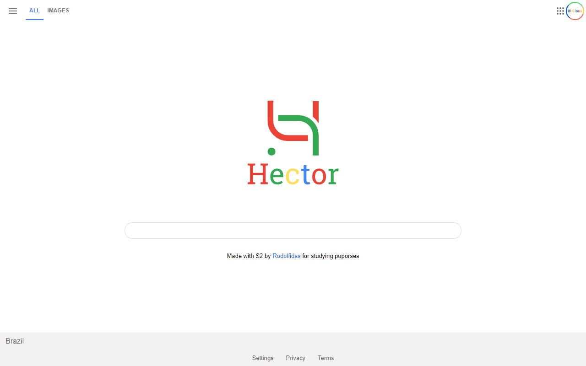
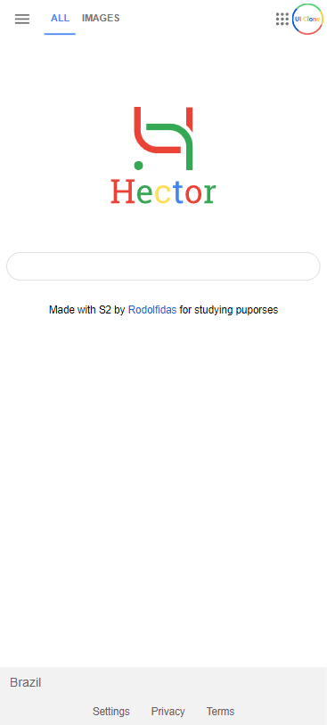

## Sobre o Projeto
- ### Recriar página principal do google;
- > ### Link: https://www.youtube.com/watch?v=KgjzE1Sxtq0

## Objetivo
- ### Usar "@media" para tornar a página responsível;
- ### Fixar conteúdos de HTML e CSS.

## 💻Tecnologias Utilizadas💻
- ### 🧱 HTML (Estrutura);
- ### 🏠 CSS  (Estilização);

## Visão Geral do Projeto

## Visão Geral do Projeto - Modo Responsivo

